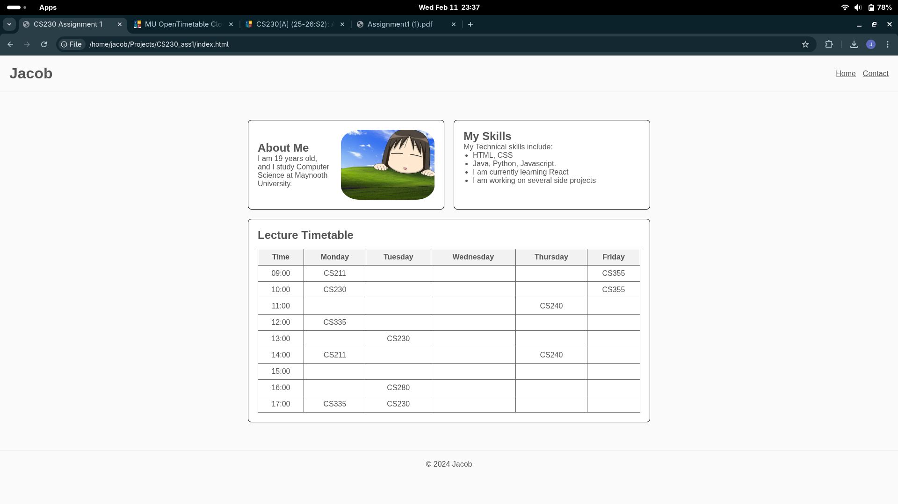
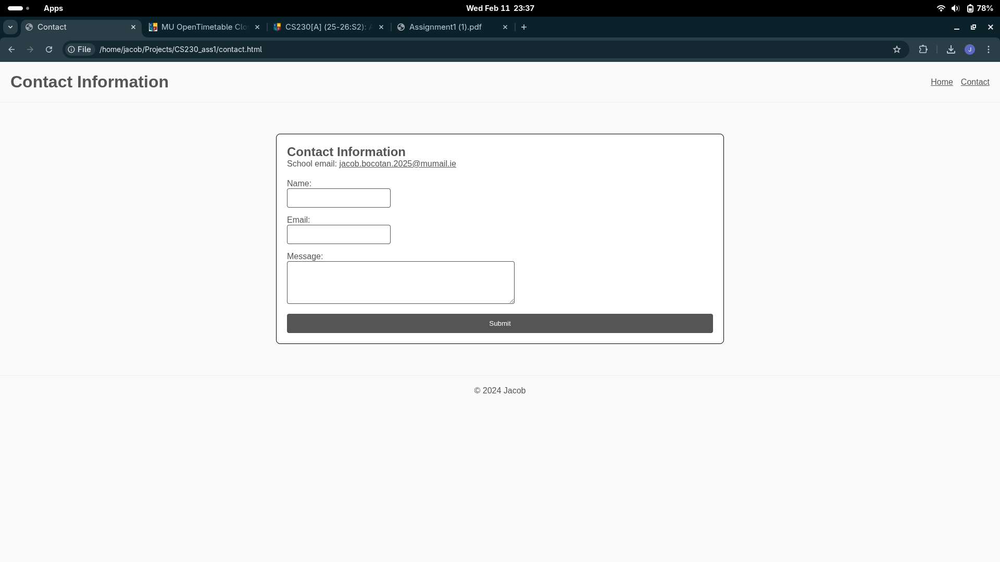

# CS230 Assignment 1 - Mini Profile Website

This project is a two-page mini profile website created as part of the CS230 Web Development coursework.

This website assignment demonstrates semantic HTML, CSS styling, Flexbox layout, and basic form structure.

# Features
- Semantic HTML5 structure
- Multi-page navigation
- Flexbox card layout
- CSS Box Model styling
- Weekly timetable data table
- Contact form with labels and accessibility
- Responsice card wrapping using 'flex-wrap'

# Technologies used
- HTML5
- CSS3
- Flexbox Layout

# Home Page ('index.html')
- About Me section
- Skills list
- Weekly lecture timetable
- Card layout styled with CSS

# Contact Page
- Contact information
- Contact form with:
  - Name input
  - Email input
  - Text message area
  - Submit button

# Styling
- CSS Box Model (padding, margin, borders)
- Flexbox layout
- Card-based content design
- Arial font styling
- Consistent navigation layout

# Screenshots

# Running
1. Download the repository
2. Open 'index.html' in a web browser
3. Use the navigation bar to move between pages

